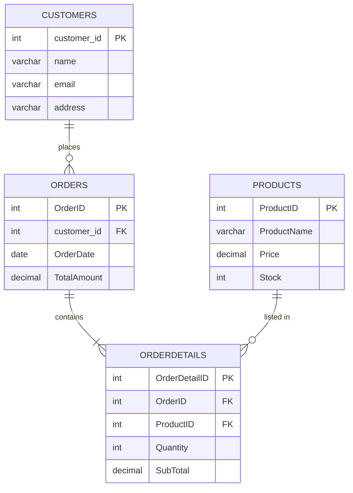

<div align="center">


</div>

<h1 align="center">🔍 Data Digger</h1>
<p align="center"><b>A hands-on SQL project covering table design, CRUD operations, filtering, sorting, and aggregation across a mini e-commerce dataset.</b></p>

---

## 📖 Overview

**Data Digger** is a small relational database built to practice real-world SQL skills. It models a simple e-commerce system with **four connected tables** — customers, orders, products, and order details — and runs a full set of queries on them: inserts, updates, deletes, filters, joins-by-key, sorting, and aggregate reporting.

Every query in `data_digger.sql` is documented below with its **exact terminal-style output**, generated from the live data.

---

## 🧩 Database Schema



---

## 📁 Project Files

| File | Description |
|---|---|
| 🗂️ `data_digger.sql` | Full SQL script — table creation, inserts, updates, deletes, and analytical queries |
| 👤 `customers.csv` | Customer records after edits and deletions |
| 📦 `orders.csv` | Order records after edits and deletions |
| 🛍️ `products.csv` | Product catalog after edits and deletions |
| 🧾 `orderdetails.csv` | Line-item breakdown linking orders to products |

---

## 👤 Customers Table

<details>
<summary><b>▶️ View queries & output</b></summary>

**Insert 6 customers, then view all**
```sql
mysql> SELECT * FROM customers;
```
```
+-------------+---------+--------------------+--------------+
| customer_id | name    | email              | address      |
+-------------+---------+--------------------+--------------+
|           1 | Alice   | alice@gmail.com     | alice house  |
|           2 | Bob     | bob@gmail.com       | bob house    |
|           3 | Charlie | charlie@gmail.com   | charlie home |
|           4 | Darwin  | darwin@gmail.com    | darwin house |
|           5 | Eleth   | Eleth@gmail.com     | Eleth house  |
|           6 | Alice   | alices1@gmail.com   | Amma house   |
+-------------+---------+--------------------+--------------+
6 rows in set
```

**Fix a typo in Charlie's address**
```sql
mysql> UPDATE customers SET address = 'charlie house' WHERE customer_id = 3;
```
```
Query OK, 1 row affected
```

**Remove Eleth's record**
```sql
mysql> DELETE FROM customers WHERE customer_id = 5;
```
```
Query OK, 1 row affected
```

**Find every customer named Alice**
```sql
mysql> SELECT * FROM customers WHERE name = 'Alice';
```
```
+-------------+-------+--------------------+-------------+
| customer_id | name  | email              | address     |
+-------------+-------+--------------------+-------------+
|           1 | Alice | alice@gmail.com    | alice house |
|           6 | Alice | alices1@gmail.com  | Amma house  |
+-------------+-------+--------------------+-------------+
2 rows in set
```

</details>

---

## 📦 Orders Table

<details>
<summary><b>▶️ View queries & output</b></summary>

**Orders placed by customer 1 (Alice), before correction**
```sql
mysql> SELECT * FROM Orders WHERE customer_id = 1;
```
```
+---------+-------------+------------+-------------+
| OrderID | customer_id | OrderDate  | TotalAmount |
+---------+-------------+------------+-------------+
|     101 |           1 | 2026-07-01 |     1500.00 |
|     104 |           1 | 2026-07-15 |     3200.75 |
+---------+-------------+------------+-------------+
2 rows in set
```

**Correct Order 101's total**
```sql
mysql> UPDATE Orders SET TotalAmount = 1750.00 WHERE OrderID = 101;
```
```
Query OK, 1 row affected
```

**Cancel Order 103**
```sql
mysql> DELETE FROM Orders WHERE OrderID = 103;
```
```
Query OK, 1 row affected
```

**Look for orders placed on/after 2026-07-23**
```sql
mysql> SELECT * FROM Orders WHERE OrderDate >= '2026-07-23';
```
```
Empty set
```
*No orders fall in this future window — every remaining order was placed before that date.*

**Order value summary**
```sql
mysql> SELECT MAX(TotalAmount) AS Highest_Order,
              MIN(TotalAmount) AS Lowest_Order,
              AVG(TotalAmount) AS Average_Order
       FROM Orders;
```
```
+---------------+--------------+---------------+
| Highest_Order | Lowest_Order | Average_Order |
+---------------+--------------+---------------+
|       3200.75 |       500.00 |     1912.8125 |
+---------------+--------------+---------------+
1 row in set
```

</details>

---

## 🛍️ Products Table

<details>
<summary><b>▶️ View queries & output</b></summary>

**Full catalog, priciest first**
```sql
mysql> SELECT * FROM Products ORDER BY Price DESC;
```
```
+-----------+----------------------+---------+-------+
| ProductID | ProductName          | Price   | Stock |
+-----------+----------------------+---------+-------+
|         5 | Webcam HD            | 2200.00 |     8 |
|         2 | Bluetooth Headphones | 1800.00 |    10 |
|         4 | Laptop Stand         | 1200.00 |    15 |
|         3 | USB Keyboard         |  650.00 |     0 |
|         1 | Wireless Mouse       |  450.00 |    25 |
+-----------+----------------------+---------+-------+
5 rows in set
```

**Reprice the Wireless Mouse**
```sql
mysql> UPDATE Products SET Price = 500.00 WHERE ProductID = 1;
```
```
Query OK, 1 row affected
```

**Clear out-of-stock items (USB Keyboard)**
```sql
mysql> DELETE FROM Products WHERE Stock = 0;
```
```
Query OK, 1 row affected
```

**Mid-range products (₹500 – ₹2000)**
```sql
mysql> SELECT * FROM Products WHERE Price BETWEEN 500 AND 2000;
```
```
+-----------+----------------------+---------+-------+
| ProductID | ProductName          | Price   | Stock |
+-----------+----------------------+---------+-------+
|         1 | Wireless Mouse       |  500.00 |    25 |
|         2 | Bluetooth Headphones | 1800.00 |    10 |
|         4 | Laptop Stand         | 1200.00 |    15 |
+-----------+----------------------+---------+-------+
3 rows in set
```

**Price range check**
```sql
mysql> SELECT MAX(Price) AS Most_Expensive, MIN(Price) AS Cheapest FROM Products;
```
```
+----------------+----------+
| Most_Expensive | Cheapest |
+----------------+----------+
|        2200.00 |   500.00 |
+----------------+----------+
1 row in set
```

</details>

---

## 🧾 Order Details & Analytics

<details>
<summary><b>▶️ View queries & output</b></summary>

**Items inside Order 101**
```sql
mysql> SELECT * FROM OrderDetails WHERE OrderID = 101;
```
```
+---------------+---------+-----------+----------+----------+
| OrderDetailID | OrderID | ProductID | Quantity | SubTotal |
+---------------+---------+-----------+----------+----------+
|             1 |     101 |         1 |        2 |  1000.00 |
|             2 |     101 |         4 |        1 |  1200.00 |
+---------------+---------+-----------+----------+----------+
2 rows in set
```

**Total revenue across all orders**
```sql
mysql> SELECT SUM(SubTotal) AS Total_Revenue FROM OrderDetails;
```
```
+---------------+
| Total_Revenue |
+---------------+
|       7400.00 |
+---------------+
1 row in set
```

**Top 3 best-selling products by quantity**
```sql
mysql> SELECT ProductID, SUM(Quantity) AS Total_Quantity_Sold
       FROM OrderDetails
       GROUP BY ProductID
       ORDER BY Total_Quantity_Sold DESC
       LIMIT 3;
```
```
+-----------+----------------------+
| ProductID | Total_Quantity_Sold  |
+-----------+----------------------+
|         1 |                    2 |
|         4 |                    2 |
|         2 |                    1 |
+-----------+----------------------+
3 rows in set
```

**How many times has Product 4 (Laptop Stand) been ordered?**
```sql
mysql> SELECT ProductID, COUNT(*) AS Times_Sold
       FROM OrderDetails WHERE ProductID = 4
       GROUP BY ProductID;
```
```
+-----------+------------+
| ProductID | Times_Sold |
+-----------+------------+
|         4 |          2 |
+-----------+------------+
1 row in set
```

</details>

---

## 📊 Business Insights

| Metric | Value |
|---|---|
| 💰 Total revenue generated | **₹7,400.00** |
| 🏆 Highest single order | **₹3,200.75** (Order 104, Alice) |
| 📉 Lowest single order | **₹500.00** (Order 105, Darwin) |
| 📐 Average order value | **₹1,912.81** |
| ⭐ Most expensive product | **Webcam HD** — ₹2,200.00 |
| 💸 Cheapest product | **Wireless Mouse** — ₹500.00 |
| 🔁 Most repeated purchase | **Laptop Stand** — bought in 2 separate orders |

---

## 🗺️ Query Flow


---

## 🛠️ Concepts Practiced

- 🏗️ Table design with `PRIMARY KEY` & `FOREIGN KEY` constraints
- 📝 `INSERT`, `UPDATE`, `DELETE` operations
- 🔎 Filtering with `WHERE`, `BETWEEN`, and date comparisons
- 🔃 Sorting with `ORDER BY`
- 📊 Aggregation with `MAX`, `MIN`, `AVG`, `SUM`, `COUNT`
- 🧮 Grouping data with `GROUP BY` and ranking with `LIMIT`
- 🔗 Relational integrity across 4 linked tables

---

<div align="center">

### 🌟 A small dataset, a full SQL workout.

</div>
